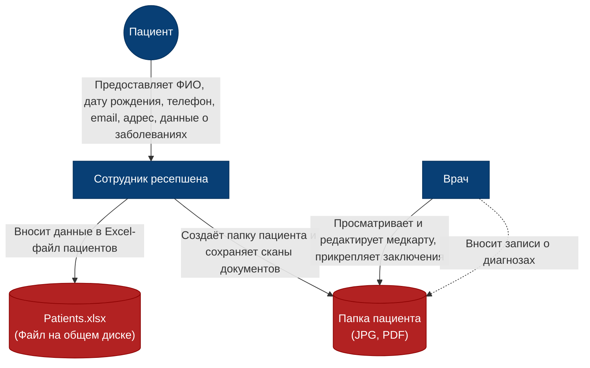
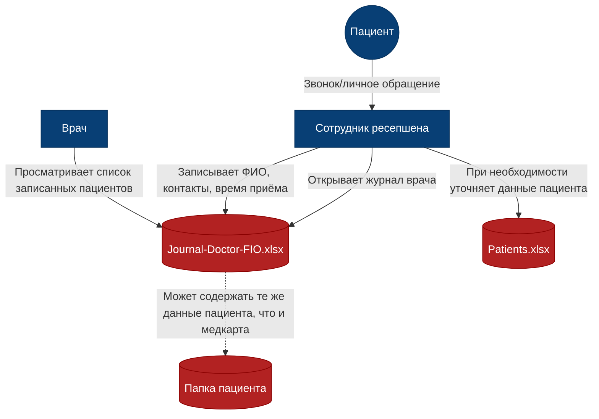
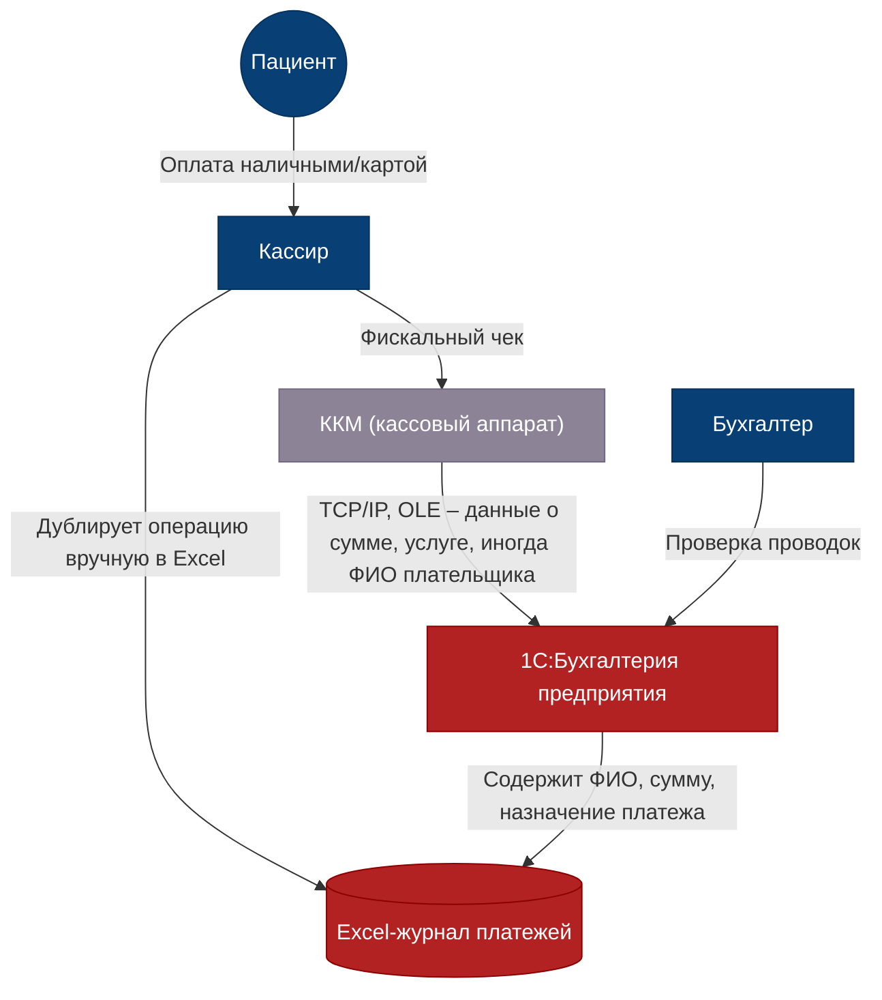
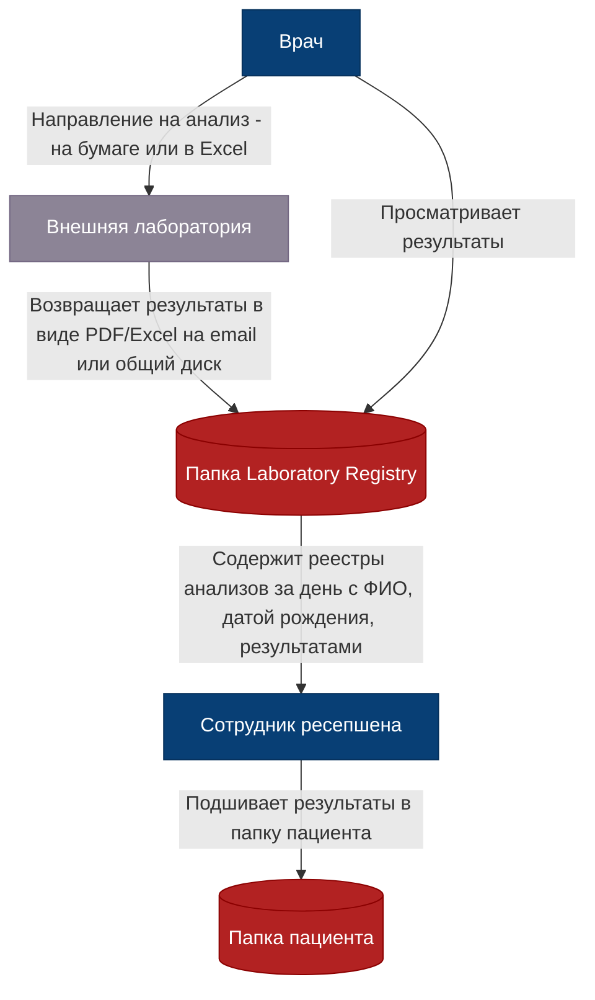
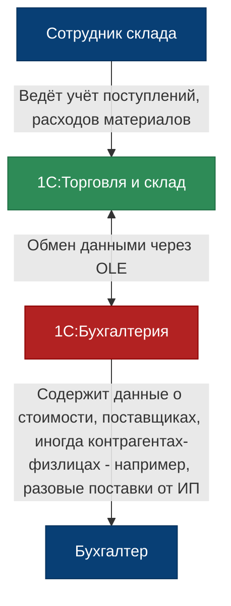
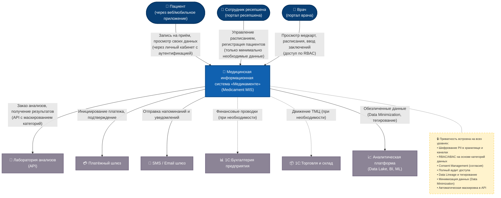

# Задание 1

## Список проблем компании в разрезе работы с данными

### 1. Хранение и управление данными
- **Локальное неструктурированное хранение:** персональные данные (ФИО, дата рождения, телефон, email, адрес, место работы, сведения о заболеваниях) и медицинские документы хранятся в файлах Excel, JPG, PDF на общем файловом сервере без шифрования.
- **Отсутствие централизованного каталога данных:** папки структурированы стихийно (по врачам, по пациентам), нет единого реестра пациентов с разграничением доступа.
- **Дублирование информации:** журналы приёма, карты пациентов и учёт платежей ведутся параллельно в Excel и бумажных/сканированных копиях, что повышает риск рассинхронизации и утечки.
- **Нет аудита действий с файлами:** доступ к файлам не логируется, невозможно отследить, кто, когда и какие данные открывал, изменял или копировал.

### 2. Контроль доступа и аутентификация
- **Единственная защита – доменная аутентификация (Active Directory):** после входа в сеть сотрудник получает доступ ко всем доступным ему сетевым дискам без гранулярных ограничений на уровне конфиденциальных документов.
- **Отсутствие RBAC/ABAC:** права не разграничены по ролям (например, кассир может видеть медицинские карты, врач – бухгалтерскую отчётность).
- **Парольная политика минимальна:** нет обязательной двухфакторной аутентификации, нет политик сложности паролей для файловых ресурсов.
- **Не учитывается модель нулевого доверия:** любой пользователь внутри сети потенциально может обратиться к любым данным, расположенным на файловом сервере.

### 3. Обработка и передача данных
- **Ручной ввод и обработка PII:** регистрация пациентов, заполнение расширенных анкет выполняется сотрудниками вручную, данные сразу видны в незащищённом виде.
- **Передача данных по незащищённым каналам:** обмен между 1С и ККМ через TCP/IP/OLE происходит без шифрования, логи доступа не ведутся.
- **Интеграция с лабораторией отсутствует в цифровом виде:** реестры анализов хранятся в общих папках, доступ к ним не разграничен. При будущем API-интегрировании не предусмотрено сокрытие чувствительных данных на уровне контрактов.
- **Не соблюдается принцип минимизации данных:** в одной Excel-таблице могут быть собраны все поля пациента, включая избыточные, которые не нужны для конкретного процесса (например, хронические заболевания видны на ресепшене при записи).

### 4. Защита от утечек и соответствие законодательству
- **Нарушение требований 152-ФЗ «О персональных данных»:**
  - Не определён оператор ПДн и ответственный за организацию обработки.
  - Не проведена классификация информационных систем персональных данных (ИСПДн).
  - Не реализованы организационные и технические меры защиты (шифрование, DLP, разграничение прав, контроль машинных носителей).
  - Нет процедуры согласия на обработку ПДн в цифровом виде.
  - Отсутствует механизм реагирования на запросы субъектов (удаление, уточнение данных).
- **Риск утечек через съёмные носители и облачные сервисы:** файлы с ПДн могут быть скопированы на USB-накопители или отправлены по личной почте без блокировки.
- **Нет системы обнаружения и предотвращения утечек (DLP).**
- **Резервное копирование и физическая безопасность сервера не регламентированы:** сервер размещён в офисе, доступ к нему физически могут иметь посторонние.

### 5. Качество данных и процессы
- **Низкая достоверность данных:** из-за ручного ввода много ошибок, дубликатов пациентов, неполных записей.
- **Отсутствие Data Lineage:** невозможно проследить происхождение и преобразование данных, что критично при аудите и разборе инцидентов.
- **Нет возможности тегирования чувствительных данных** и автоматического применения политик защиты на основе тегов.

### 6. Масштабирование и развитие
- **Текущая архитектура не готова к пятикратному росту:** хранение документов в Excel на общем диске не масштабируется, при увеличении числа филиалов синхронизация станет хаотичной.
- **Невозможно внедрить BI/ML/AI без озера данных и очистки чувствительной информации:** данные в Excel не пригодны для аналитики, а их прямое использование нарушит конфиденциальность.

---

## Диаграммы потоков данных (As-Is)

### Процесс 1: Регистрация нового пациента и ведение медицинской карты

**Проблемы на схеме:**  
- Файлы с PII и медицинскими данными хранятся открыто, без шифрования.  
- Любой сотрудник с доступом к общей папке может прочитать или скопировать конфиденциальные сведения.  
- Врач и ресепшен имеют одинаковый уровень доступа к полной медкарте, нет принципа минимизации.

---

### Процесс 2: Запись пациента на приём к специалисту

**Проблемы:**  
- Журнал записи доступен всем сотрудникам ресепшена и врачу, нет разграничения по ролям.  
- Сведения о визите пациента (включая его контакты) хранятся в файле без аудита и шифрования.  
- Нет автоматической проверки, что ресепшен видит только минимум данных, необходимый для записи.

---

### Процесс 3: Приём платежа от пациента

**Проблемы:**  
- Данные о платежах (включая ФИО пациента) передаются от ККМ в 1С без шифрования.  
- Двойной учёт (Excel + 1С) увеличивает поверхность атаки: файл Excel может быть скопирован.  
- Нет контроля целостности данных между системами.

---

### Процесс 4: Заказ и получение результатов анализов из лаборатории

**Проблемы:**  
- Результаты анализов (категория «специальные» ПДн – сведения о здоровье) хранятся в открытом виде.  
- Email как канал передачи не защищён сквозным шифрованием.  
- Лабораторный реестр доступен для чтения всем, кто имеет доступ к сетевой папке, в том числе сотрудникам, не имеющим отношения к лечебному процессу.

---

### Процесс 5: Учёт товарно-материальных ценностей (ТМЦ)

**Проблемы:**  
- Хотя здесь реже встречаются медицинские PII, интеграция через OLE без контроля канала может привести к утечке контрагентских данных, которые тоже относятся к ПДн.  
- Отсутствует изоляция складской системы от бухгалтерской, что нарушает принцип минимально необходимых привилегий.

# Задание 2

## Диаграмма контекста C4 целевого состояния (MVP)

### Пояснение ключевых блоков

**1. Новая Medical Information System (MIS)**  
Центральный узел, объединяющий порталы для пациентов, ресепшена и врачей. В MVP реализует:  
- самостоятельную запись пациента через личный кабинет;  
- отображение записи у ресепшена и врача;  
- уведомления за день до приёма (через Email/SMS);  
- категоризацию данных пациентов и управление доступом по RBAC/ABAC;  
- аудит всех операций с конфиденциальными данными.

**2. Механизмы Privacy by Design** (вынесены в заметку на диаграмме)  
- **Шифрование** PII в БД и на транспортном уровне (TLS).  
- **Тегирование данных** для автоматического применения политик защиты.  
- **Data Minimization** – на каждом пользовательском интерфейсе отображается только необходимый набор полей.  
- **Consent Management** – учёт согласий пациента, возможность отзыва.  
- **API Gateway** с проверкой scope и маскированием чувствительных атрибутов (например, пациент не видит данные других пациентов).  
- Полный **Audit Trail** и алертинг при аномалиях.

**3. Аналитический слой**  
Отдельная система (Data Lake + BI), куда данные поступают после обезличивания и тегирования. Это позволяет строить отчёты и ML-модели без риска раскрытия персональных данных. В целевом состоянии этот слой обеспечивает требования по масштабируемости и развитию AI/ML сервисов.

**4. Внешние системы**  
Интеграция с лабораторией и платёжным шлюзом происходит через защищённые API с контролем конфиденциальности (контракты не пропускают избыточные данные). Существующие 1С‑системы оставлены на диаграмме пунктиром, так как в будущем они могут быть заменены, но пока через MIS в них могут передаваться обезличенные финансовые/складские транзакции.

# Задание 3
## Классификация данных и инструменты защиты

| Данные | В чём необходимость защиты | Инструменты защиты |
|--------|---------------------------|-------------------|
| **Персональные данные пациентов (ФИО, дата рождения, телефон, email, адрес, паспортные данные)** | Требования 152-ФЗ, высокий риск идентификации и утечки, репутационные и финансовые риски. Несанкционированный доступ может привести к мошенничеству, нарушению приватности. | Шифрование на уровне БД (TDE, AES-256), шифрование резервных копий. Маскирование в интерфейсах (частичное отображение). Токенизация для аналитических сред. TLS 1.3 при передаче. DLP-система для контроля каналов. Управление ключами через HSM/KMS (например, HashiCorp Vault). RBAC/ABAC. Аудит доступа. |
| **Специальные категории ПДн (сведения о здоровье, диагнозы, результаты анализов, хронические заболевания)** | Наиболее чувствительные данные по 152-ФЗ (ст.10). Утечка наносит непоправимый вред пациенту, ведёт к дискриминации. Медицинская тайна. | Шифрование на уровне приложения (полевое шифрование) с отдельными ключами. TLS с взаимной аутентификацией (mTLS) при интеграции с лабораторией. Строгий аудит и алертинг. Изоляция в отдельном контуре хранения. Автоматическое обезличивание для BI/ML (k-anonymity, differential privacy). Контроль согласий (Consent Management). |
| **Финансовые данные (платежи, счета, истории транзакций, данные банковских карт)** | Требования PCI DSS (если применимо), 161-ФЗ «О национальной платежной системе». Риск финансового мошенничества. Необходимость целостности и неотказуемости. | Токенизация PAN, шифрование по стандарту PCI (AES-256). Защита каналов: TLS 1.3, P2PE для терминалов. Использование сертифицированного платежного шлюза с изоляцией от основных систем. HSM для хранения ключей шифрования карт. Мониторинг транзакций (Fraud Detection). |
| **Учётные данные сотрудников и пациентов (логины, пароли, роли, сессии, токены аутентификации)** | Компрометация учётных записей открывает доступ ко всей системе. Нарушение целостности и доступности. | Хеширование паролей (bcrypt/argon2) с солью. Хранение токенов в зашифрованном виде (JWT с шифрованием). Защита сессий (HttpOnly, Secure флаги). Многофакторная аутентификация. Применение LDAPS. Управление секретами через Vault. Ротация ключей. |
| **Метаданные и логи доступа (аудит-логи, журналы операций, информация о действиях пользователей)** | Могут содержать косвенные ПДн, раскрывают паттерны поведения. Подлежат защите согласно 152-ФЗ (записи об обработке). Необходима целостность для расследования инцидентов. | Шифрование логов при хранении (write-only с защитой от изменения). Передача логов по защищённому каналу (TLS) в централизованную SIEM. Разграничение доступа к логам на основе ролей. Установка политик хранения и автоматического удаления. Цифровая подпись логов. |
| **Данные для аналитики (обезличенные датасеты, отчёты BI, обучающие выборки для ML)** | Риск ре-идентификации при недостаточном обезличивании. Требования 152-ФЗ к обезличенным данным (Приказ Роскомнадзора №996). Конфиденциальность бизнес-аналитики. | Де-идентификация перед загрузкой в Data Lake (методы псевдонимизации, маскирования, агрегирования). Шифрование хранилища DWH (HDFS encryption, S3 SSE-KMS). Контроль доступа на уровне таблиц/колонок (Apache Ranger, AWS Lake Formation). Аудит запросов. Регулярная проверка устойчивости к ре-идентификации. |
| **Документы и файлы на общем диске (договоры, сканы, Excel-журналы)** | Текущее состояние — полное отсутствие защиты. Файлы содержат ПДн и коммерческую тайну. Необходимость перехода к структурированному хранению. | Замена файлового хранения на ECM/СЭД с шифрованием контента (Microsoft Purview Information Protection, Varonis). Шифрование жёстких дисков серверов (BitLocker/LUKS). DLP-система для блокировки копирования на съёмные носители. Автоматическая классификация и тегирование. На период миграции — шифрование папок EFS/VeraCrypt. |
| **Резервные копии и архивы** | Содержат все перечисленные выше данные. Утеря или кража резервных носителей — распространённый вектор атак. | Шифрование резервных копий на уровне клиента (Veeam, Commvault) перед отправкой. Хранение носителей в опечатанных сейфах. Разделение ключей шифрования от самих бэкапов. Регулярное тестирование восстановления. |
| **Сетевой трафик между компонентами (MIS – лаборатория, MIS – платёжный шлюз, офис – сервер)** | Перехват трафика при интеграциях или в незащищённых сетях (включая филиалы) грозит утечкой ПДн и нарушением целостности. | Обязательное использование TLS 1.3 с сертификатами от доверенного УЦ. Для межфилиальной связи — VPN-туннели (IPSec/WireGuard). Взаимная аутентификация сервисов (mTLS). Сегментация сети и микросегментация. API Gateway с контролем целостности запросов. |

# Задание 4

### 1. Диаграмма Исикавы (Fishbone)

Файл drawio [тут](./task-4/ДиаграммаИсикавы.drawio)

### 2. Выявленные проблемы по категориям

#### Инфраструктура
- Единственный физический сервер без отказоустойчивости и резервного копирования не готов к росту числа филиалов.
- Отсутствие облачных ресурсов затрудняет быстрое масштабирование под пиковые нагрузки.
- Локальная сеть не сегментирована, что увеличивает поверхность атаки.
- Нет плана аварийного восстановления (DR).

#### Программное обеспечение
- Критичные системы (1С) работают в файловом режиме без API, что блокирует современные интеграции.
- Основное хранилище клинических и административных данных — Excel и файловые папки, не обеспечивающие целостность и конкурентный доступ.
- Отсутствуют процессы CI/CD и контейнеризации, замедляющие выпуск обновлений.
- Контрольно-кассовые машины жёстко связаны с 1С через устаревшую технологию OLE, что усложняет замену.

#### Интеграция
- Взаимодействие с лабораторией — через файлы и email, без стандартизированного API.
- Нет централизованной шины данных или API Gateway, каждый новый партнёр добавляет хаос.
- Передача данных между компонентами не шифруется и не логируется.

#### Персонал
- Текущая IT-команда (3 человека) не имеет опыта в распределённых системах, облачных технологиях и высоконагруженных сервисах.
- Сотрудники привыкли к ручным Excel-процессам, вероятно сопротивление автоматизации.
- Отсутствует выделенная группа для управления миграцией, что увеличивает риск ошибок.
- Знания о критичных настройках сконцентрированы у одного-двух человек.

#### Процессы
- Бизнес-процессы не формализованы, многие шаги выполняются вручную, что приводит к рассинхронизации при переносе в новую систему.
- Нет аудита действий, невозможно отследить, кто и когда менял данные.
- Не определён владелец качества данных, никто не отвечает за чистоту реестров.
- Двойной учёт (Excel и 1С) создаёт расхождения, которые придётся выверять при миграции.

#### Безопасность и данные
- Персональные данные и медицинская тайна хранятся без шифрования и классификации, что прямо нарушает 152-ФЗ.
- Отсутствует цифровое управление согласиями пациентов.
- Данные в Excel содержат множество дубликатов, опечаток, устаревших записей — без очистки миграция невозможна.
- Нет механизмов тегирования чувствительной информации и отслеживания происхождения данных (Data Lineage).

### 3. Рекомендации и приоритетность

| Приоритет | Меры по устранению | Затрагиваемые категории |
|-----------|-------------------|--------------------------|
| **Критический** | Провести аудит и очистку данных: удалить дубликаты, унифицировать справочники, верифицировать согласия пациентов. Без этого миграция невозможна. | Безопасность и данные, Процессы |
| **Критический** | Внедрить шифрование и контроль доступа уже на этапе подготовки: защитить файловый сервер (EFS), включить аудит доступа к папкам с ПДн, начать классификацию данных. | Безопасность и данные, Инфраструктура |
| **Высокий** | Разработать API-адаптеры для 1С и лаборатории как промежуточный слой, чтобы новая система могла сразу интегрироваться, а устаревшие системы постепенно выводить. | Интеграция, ПО |
| **Высокий** | Организовать облачную инфраструктуру (IaaS) с резервированием для MVP, настроить VPN до офиса для гибридного режима. | Инфраструктура |
| **Высокий** | Сформировать выделенную миграционную команду, включая бизнес-аналитика и специалиста по данным, обучить персонал новым процессам. | Персонал, Процессы |
| **Средний** | Формализовать бизнес-процессы (BPMN), разработать регламенты работы в новой системе до запуска. Провести обучение пользователей. | Процессы, Персонал |
| **Средний** | Внедрить CI/CD и контейнеризацию для новых сервисов, чтобы ускорить итерации и снизить риски релизов. | ПО |
| **Низкий** | Постепенно вывести из эксплуатации физический сервер, перенеся оставшиеся сервисы (почта, AD) в облачные аналоги (Exchange Online, Azure AD). | Инфраструктура |