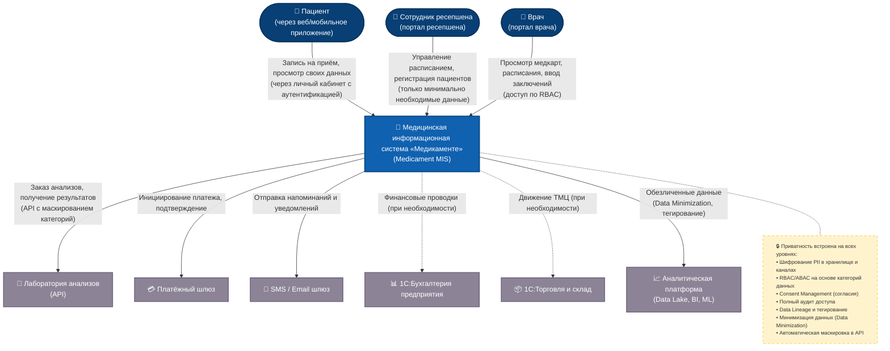

## Диаграмма контекста C4 целевого состояния (MVP)

### Пояснение ключевых блоков

**1. Новая Medical Information System (MIS)**  
Центральный узел, объединяющий порталы для пациентов, ресепшена и врачей. В MVP реализует:  
- самостоятельную запись пациента через личный кабинет;  
- отображение записи у ресепшена и врача;  
- уведомления за день до приёма (через Email/SMS);  
- категоризацию данных пациентов и управление доступом по RBAC/ABAC;  
- аудит всех операций с конфиденциальными данными.

**2. Механизмы Privacy by Design** (вынесены в заметку на диаграмме)  
- **Шифрование** PII в БД и на транспортном уровне (TLS).  
- **Тегирование данных** для автоматического применения политик защиты.  
- **Data Minimization** – на каждом пользовательском интерфейсе отображается только необходимый набор полей.  
- **Consent Management** – учёт согласий пациента, возможность отзыва.  
- **API Gateway** с проверкой scope и маскированием чувствительных атрибутов (например, пациент не видит данные других пациентов).  
- Полный **Audit Trail** и алертинг при аномалиях.

**3. Аналитический слой**  
Отдельная система (Data Lake + BI), куда данные поступают после обезличивания и тегирования. Это позволяет строить отчёты и ML-модели без риска раскрытия персональных данных. В целевом состоянии этот слой обеспечивает требования по масштабируемости и развитию AI/ML сервисов.

**4. Внешние системы**  
Интеграция с лабораторией и платёжным шлюзом происходит через защищённые API с контролем конфиденциальности (контракты не пропускают избыточные данные). Существующие 1С‑системы оставлены на диаграмме пунктиром, так как в будущем они могут быть заменены, но пока через MIS в них могут передаваться обезличенные финансовые/складские транзакции.