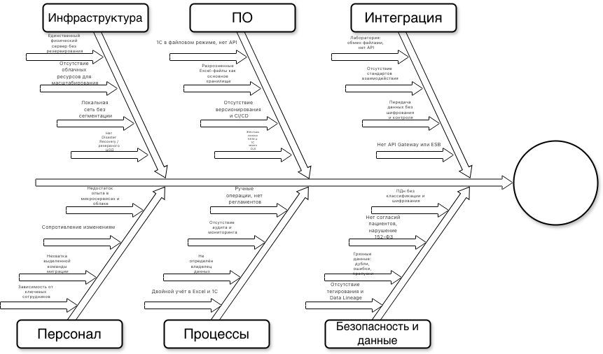

### 1. Диаграмма Исикавы (Fishbone)

Файл drawio [тут](./ДиаграммаИсикавы.drawio)

### 2. Выявленные проблемы по категориям

#### Инфраструктура
- Единственный физический сервер без отказоустойчивости и резервного копирования не готов к росту числа филиалов.
- Отсутствие облачных ресурсов затрудняет быстрое масштабирование под пиковые нагрузки.
- Локальная сеть не сегментирована, что увеличивает поверхность атаки.
- Нет плана аварийного восстановления (DR).

#### Программное обеспечение
- Критичные системы (1С) работают в файловом режиме без API, что блокирует современные интеграции.
- Основное хранилище клинических и административных данных — Excel и файловые папки, не обеспечивающие целостность и конкурентный доступ.
- Отсутствуют процессы CI/CD и контейнеризации, замедляющие выпуск обновлений.
- Контрольно-кассовые машины жёстко связаны с 1С через устаревшую технологию OLE, что усложняет замену.

#### Интеграция
- Взаимодействие с лабораторией — через файлы и email, без стандартизированного API.
- Нет централизованной шины данных или API Gateway, каждый новый партнёр добавляет хаос.
- Передача данных между компонентами не шифруется и не логируется.

#### Персонал
- Текущая IT-команда (3 человека) не имеет опыта в распределённых системах, облачных технологиях и высоконагруженных сервисах.
- Сотрудники привыкли к ручным Excel-процессам, вероятно сопротивление автоматизации.
- Отсутствует выделенная группа для управления миграцией, что увеличивает риск ошибок.
- Знания о критичных настройках сконцентрированы у одного-двух человек.

#### Процессы
- Бизнес-процессы не формализованы, многие шаги выполняются вручную, что приводит к рассинхронизации при переносе в новую систему.
- Нет аудита действий, невозможно отследить, кто и когда менял данные.
- Не определён владелец качества данных, никто не отвечает за чистоту реестров.
- Двойной учёт (Excel и 1С) создаёт расхождения, которые придётся выверять при миграции.

#### Безопасность и данные
- Персональные данные и медицинская тайна хранятся без шифрования и классификации, что прямо нарушает 152-ФЗ.
- Отсутствует цифровое управление согласиями пациентов.
- Данные в Excel содержат множество дубликатов, опечаток, устаревших записей — без очистки миграция невозможна.
- Нет механизмов тегирования чувствительной информации и отслеживания происхождения данных (Data Lineage).

### 3. Рекомендации и приоритетность

| Приоритет | Меры по устранению | Затрагиваемые категории |
|-----------|-------------------|--------------------------|
| **Критический** | Провести аудит и очистку данных: удалить дубликаты, унифицировать справочники, верифицировать согласия пациентов. Без этого миграция невозможна. | Безопасность и данные, Процессы |
| **Критический** | Внедрить шифрование и контроль доступа уже на этапе подготовки: защитить файловый сервер (EFS), включить аудит доступа к папкам с ПДн, начать классификацию данных. | Безопасность и данные, Инфраструктура |
| **Высокий** | Разработать API-адаптеры для 1С и лаборатории как промежуточный слой, чтобы новая система могла сразу интегрироваться, а устаревшие системы постепенно выводить. | Интеграция, ПО |
| **Высокий** | Организовать облачную инфраструктуру (IaaS) с резервированием для MVP, настроить VPN до офиса для гибридного режима. | Инфраструктура |
| **Высокий** | Сформировать выделенную миграционную команду, включая бизнес-аналитика и специалиста по данным, обучить персонал новым процессам. | Персонал, Процессы |
| **Средний** | Формализовать бизнес-процессы (BPMN), разработать регламенты работы в новой системе до запуска. Провести обучение пользователей. | Процессы, Персонал |
| **Средний** | Внедрить CI/CD и контейнеризацию для новых сервисов, чтобы ускорить итерации и снизить риски релизов. | ПО |
| **Низкий** | Постепенно вывести из эксплуатации физический сервер, перенеся оставшиеся сервисы (почта, AD) в облачные аналоги (Exchange Online, Azure AD). | Инфраструктура |