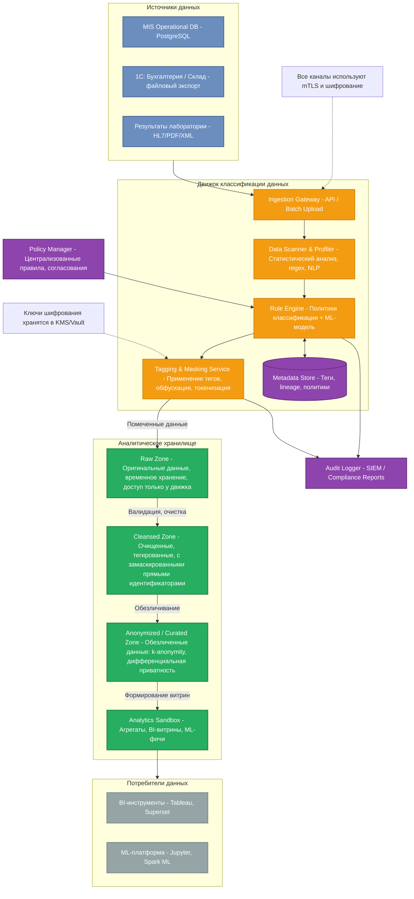

## Аналитический слой с классификацией данных (C2-диаграмма)

Ниже представлена диаграмма контейнеров (уровень C2) движка классификации данных перед загрузкой в аналитическое хранилище. Решение реализует принципы **Privacy by Design** и **Data Minimization** на всех этапах обработки.

## Описание слоёв и мер защиты

1. **Ingestion Gateway** – единая точка приёма данных из MIS, 1С и лаборатории. Обеспечивает аутентификацию источников, валидацию форматов и целостность передачи (mTLS).

2. **Data Scanner & Profiler** – автоматически анализирует входящие наборы данных:
   - Обнаружение персональных данных (ФИО, телефоны, email, паспортные данные) с помощью регулярных выражений, NER-моделей и статистических профилей.
   - Определение специальных категорий (диагнозы, результаты анализов) по ключевым словам и словарям.
   - Выявление структуры полуструктурированных данных (JSON, XML, HL7).

3. **Rule Engine** – принимает решения о классе конфиденциальности на основе:
   - Предустановленных политик (например, «поле `diagnosis` всегда `SPII`»).
   - ML-классификатора, обученного на исторических данных с участием эксперта (активное обучение).
   - Результатов сканера. Классы: `public`, `internal`, `confidential`, `restricted` (PII, SPII, финансовые).

4. **Metadata Store** – хранит теги, lineage (происхождение данных), версии политик. Обеспечивает прозрачность и аудит.

5. **Tagging & Masking Service** – применяет к данным защитные преобразования согласно классу:
   - **Шифрование** (AES-256) для restricted полей перед сохранением в Raw.
   - **Токенизация** прямых идентификаторов для Cleansed.
   - **Маскирование** (хэширование, замена на псевдонимы) для Anonymized.
   - **Обезличивание** (k-anonymity, differential privacy) на этапе Curated.

6. **Слои хранилища** обеспечивают ступенчатую очистку и минимизацию поверхности атаки:
   - **Raw Zone** – неизменяемые исходные данные, строго ограниченный доступ (только движок), короткий срок хранения.
   - **Cleansed Zone** – данные, где прямые идентификаторы заменены токенами, но возможна псевдонимизация.
   - **Anonymized Zone** – полностью обезличенные наборы, готовые для аналитики без риска ре-идентификации.
   - **Analytics Sandbox** – агрегированные витрины, безопасные для BI и ML.

## Метрики эффективности классификации

| Метрика | Назначение | Целевое значение |
|---------|------------|------------------|
| **Coverage (полнота обнаружения)** | Доля полей/записей, для которых движок смог определить класс чувствительности. Помогает выявить неразмеченные данные. | > 99% |
| **Precision (точность класса PII/SPII)** | Доля правильно классифицированных чувствительных атрибутов среди всех помеченных как чувствительные. Снижает ложные срабатывания и избыточное маскирование. | > 95% |
| **Recall (полнота класса PII/SPII)** | Доля истинных чувствительных данных, которые система обнаружила. Критична для предотвращения утечек. | > 99% |
| **False Positive Rate (FPR)** | Доля нечувствительных данных, ошибочно помеченных как чувствительные. Влияет на объём излишне защищаемых данных и производительность. | < 2% |
| **Throughput (пропускная способность)** | Объём данных, обрабатываемых в единицу времени. Обеспечивает соблюдение окон загрузки (ETL). | > 100 МБ/с на ноду |
| **Latency (задержка классификации)** | Время от поступления данных до готовности в Cleansed-слое. | p95 < 5 минут для пакетов до 10 ГБ |

**Оптимизация:**  
Регулярный анализ этих метрик позволяет дообучать ML-модель классификации, корректировать правила на основе обратной связи от офицеров безопасности, а также выявлять новые паттерны чувствительных данных в меняющихся структурах (например, при добавлении новых источников из филиалов).

## Масштабируемость системы

- **Горизонтальное масштабирование компонентов движка:** Ingestion Gateway, Scanner, Rule Engine и Tagger разворачиваются как stateless-сервисы в Kubernetes. Количество подов автоматически регулируется на основе нагрузки (HPA по CPU/длине очереди).
- **Асинхронная обработка через очередь сообщений:** Между Gateway и Scanner используется брокер (Kafka/Redis Streams), что позволяет сгладить пиковые нагрузки при ночных пакетных загрузках из лаборатории и филиалов.
- **Шардирование Metadata Store и Raw-хранилища:** Данные распределяются по дате/источнику, позволяя увеличивать пропускную способность дисков и сети.
- **Кэширование эталонных справочников и моделей:** ML-модель и регулярные выражения кэшируются в памяти каждого экземпляра, что минимизирует задержки.
- **Параллельная обработка внутри Scanner:** Для больших файлов (например, выгрузка из 1С) используется разбиение на блоки и многопоточная обработка с последующей агрегацией результатов.
- **При росте числа пользователей:** BI и ML-песочницы подключаются к Anonymized-слою через выделенные read-only реплики, что разгружает основной пайплайн.